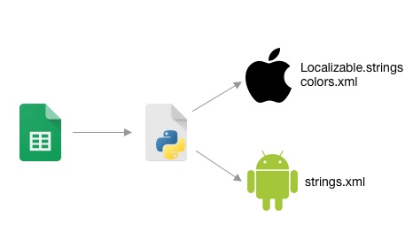
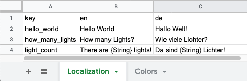
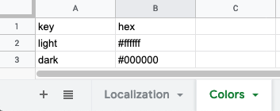
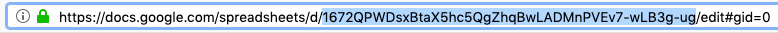

# Localization Sync
This is a python script that downloads localization strings and CI color information from a public [Google Sheet](https://docs.google.com/spreadsheets) and generates resource files for iOS and Android projects.

## Prerequisites

Create a Google Sheet document with sheets like [these](https://docs.google.com/spreadsheets/d/1672QPWDsxBtaX5hc5QgZhqBwLADMnPVEv7-wLB3g-ug):

Publish the sheeet to the web by pressing __File -> Publish to the web__. Select __Whole Document__ and __Website__. This gives the script access to the public JSON API of Google Docs.

Find the ID of your document by copying it from your browsers address bar.

## Usage

Create a `data_sync.config.json` in your project and populate it with the contents of the [example config](data_sync.config.json). Replace the `sheetId` with your own. You can modify the other settings to fit the needs of your project.

Then open a terminal at your project path and run `python3 Sources/data_sync.py`. Look for your newly created resource files.

## Example

Have a look into the [Output folder](Output) for some example files generated by using the provided [configuration file](data_sync.config.json).
